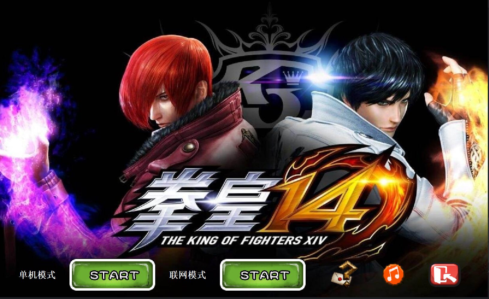
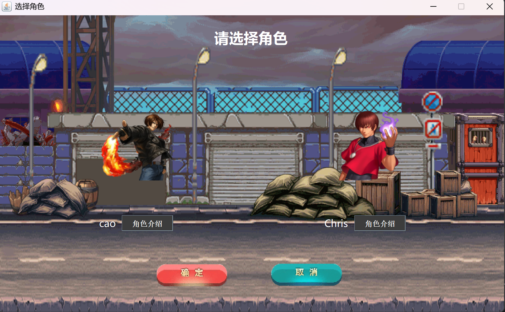
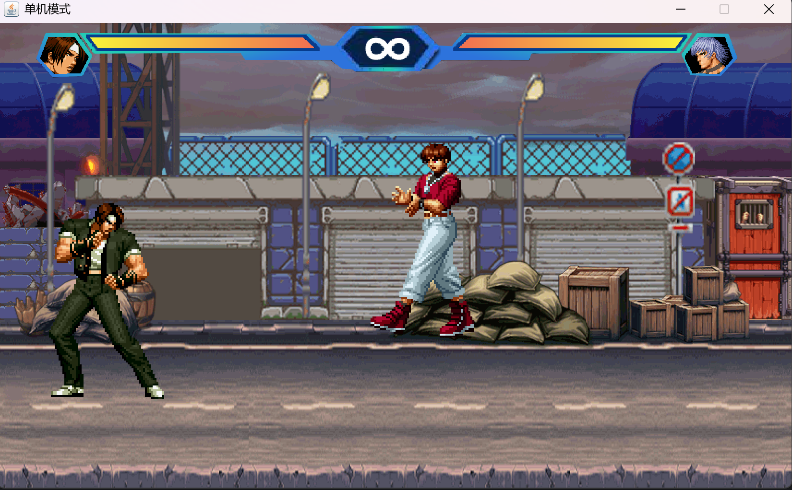
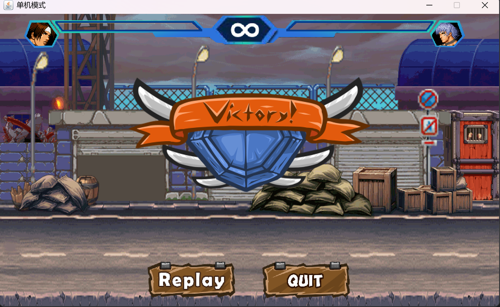
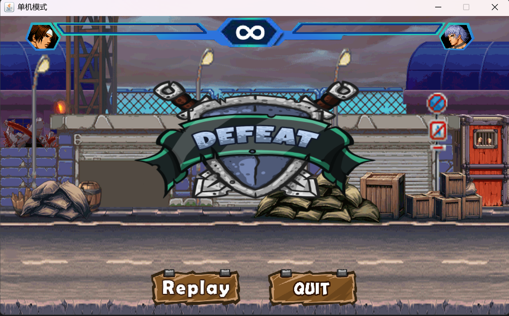

# 拳皇：Java双人网络对战游戏

## 1. 项目介绍

本项目是基于Java语言开发的一款双人网络对战拳皇游戏，采用Swing框架构建图形界面，实现了经典格斗游戏的核心玩法和网络对战功能。

### 1.1 技术栈

- **面向对象编程**：采用Java面向对象设计理念，实现了角色、攻击、碰撞检测等核心游戏机制
- **Swing GUI**：构建了美观的游戏界面，包括开始界面、角色选择、游戏主界面等
- **网络编程**：基于TCP/IP协议实现了客户端-服务器架构，支持双人实时网络对战
- **多线程技术**：使用线程处理网络通信、游戏画面刷新等并发任务
- **异常处理**：完善的异常捕获机制，确保网络连接等关键操作的稳定性
- **I/O流**：实现了客户端与服务器之间的信息传输
- **集合框架**：用于管理游戏资源和线程

## 2. 功能展示

### 2.1 开始界面

游戏启动后进入开始界面，提供多种操作选项：



#### 2.1.1 开始游戏

点击"start"按钮开始网络连接，系统会尝试连接服务器：

- 连接成功：显示等待提示，等待其他玩家加入
- 连接失败：弹出"网络连接失败"提示

  


#### 2.1.2 游戏帮助

点击问号图标进入帮助界面，查看游戏操作说明：


#### 2.1.3 背景音乐控制

- 游戏自动播放背景音乐
- 点击音乐图标可开启/关闭背景音乐
- 图标会根据当前状态切换（播放/静音）

### 2.2 游戏操作

#### 2.2.1 角色控制

游戏支持键盘控制角色移动和攻击：

- **W**：向上移动
- **S**：向下移动
- **A**：向左移动
- **D**：向右移动
- **J**：攻击



#### 2.2.2 战斗机制

- 角色具有生命值系统
- 靠近敌方角色并按下攻击键可发动攻击
- 击中敌方后，敌方生命值减少并被击倒



### 2.3 游戏结束

当一方角色生命值归零时，游戏结束：

- 胜利方：显示胜利界面
- 失败方：显示失败界面

  


游戏结束后，玩家可以选择：
- **Replay**：重新开始游戏，等待其他玩家加入
- **Quit**：返回开始界面

## 3. 项目结构

```
├── lib/             # 第三方库
├── music/           # 游戏音乐资源
├── res/             # README图片资源
├── src/             # 源代码目录
│   ├── Client/      # 客户端代码
│   │   ├── Advance/      # 高级组件（按钮、音乐）
│   │   ├── Character/    # 角色相关类
│   │   ├── Net/          # 网络客户端
│   │   ├── Protocol/     # 通信协议
│   │   ├── SurfaceGUI/   # GUI界面
│   │   └── Game.java     # 客户端入口
│   ├── Server/      # 服务器代码
│   │   └── FighterServer.java
│   └── images/      # 游戏图片资源
│       ├── Chris/        # 角色Chris图片
│       ├── cao/          # 角色cao图片
│       ├── component/    # UI组件图片
│       └── instruction/  # 说明界面图片
├── .gitignore
└── README.MD
```

## 4. 运行说明

### 4.1 环境要求

- Java 8 或以上版本

### 4.2 启动步骤

1. **启动服务器**：运行 `src/Server/FighterServer.java`（联机模式）
2. **启动客户端**：运行 `src/Client/Game.java`
3. **连接游戏**：在客户端点击"start"按钮连接服务器
4. **开始游戏**：等待另一位玩家连接后，选择角色开始对战

## 5. 游戏特色

- 经典拳皇游戏风格
- 支持双人实时网络对战
- 流畅的游戏动画效果
- 完善的游戏界面设计
- 背景音乐和音效
- 简单易上手的操作方式

## 6. 后续改进方向

- 增加更多可选角色
- 实现更多攻击技能
- 优化网络连接稳定性
- 增加游戏难度选择


## 7. 开发团队

本项目由Java爱好者开发，旨在学习和实践Java网络编程、GUI开发和游戏设计等技术。

---

**欢迎各位开发者提出宝贵意见和建议！**